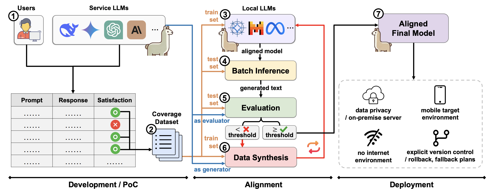

# LlamaDuo


<div><p align="center"><a href="https://huggingface.co/papers/2408.13467">[Paper Link on 🤗]</a><a href="https://huggingface.co/llama-duo">[Model Checkpoints & Synthetic Datasets on 🤗]</a></p></div>


This project showcases an LLMOps pipeline that fine-tunes a small-size LLM model to prepare for the outage of the service LLM. For this project, we chose [GPT4o](https://openai.com/index/hello-gpt-4o/), [Claude 3 Sonnet](https://docs.anthropic.com/en/docs/about-claude/models#model-comparison-table), [Gemini 1.5 Flash](https://deepmind.google/technologies/gemini/) as service LLM for data synthesis and response evaluation, and we chose [Gemma 2B, 7B](https://blog.google/technology/developers/gemma-open-models/), [Mistral 7B 0.3](https://huggingface.co/mistralai/Mistral-7B-v0.3), and [LLaMA3 8B](https://huggingface.co/meta-llama/Meta-Llama-3-8B) for small sized LLM. To understand the effectiveness and feasibility of LlamaDuo, please read our [paper](https://huggingface.co/papers/2408.13467) with comprehensive analysis.


> [!IMPORTANT]
> 
> If you use the data or code in this repo, please consider citing the following paper.

```BibTex
@article{park2024llamaduo,
  title={LlamaDuo: LLMOps Pipeline for Seamless Migration from Service LLMs to Small-Scale Local LLMs},
  author={Park, Chansung and Jiang, Juyong and Wang, Fan and Paul, Sayak and Tang, Jing},
  journal={arXiv preprint arXiv:2408.13467},
  year={2024}
}
```


**Table of contents**

* [Motivation](#motivation)
* [Tech stacks](#tech-stacks)
* [Overview](#overview)
* [Building on top of this project](#building-on-top-of-this-project)
* [Acknowledgements](#acknowledgments)

## Motivation

We assume that a small LLM could show comparable performance to that of a service-type LLM on a specific task, and this project tries to showcase such a possibility in a practically grounded manner. Furthermore, this project shows how to migrate from service LLM to small LLM smoothly. 

Assume that service LLM is integrated into your service or system. However, from time to time, the service LLM should be replaced for the following reaons:
- failure of service LLM, which may be operationally impacting a business.
- data privacy issue. You don't want to expose your private data.
- some system runs without internet connection. Service LLM did a great job on PoC, but now you need the same intelligence in an on-premise environment.
- version control issue. Service LLMs change their versions from time to time, and legacy versions will become obsolete. However, we just want to keep the behavior as is.
- ...

To better prepare for such impacting situations, this project suggests migrating from a service LLM to a local small LLM. Since we are satisfied with the results from service LLM, we know our inputs (prompts) and the desired outputs. Then, we can fine-tune small size LLM on the collected prompts to match the desired outputs. Furthermore, if the fine-tuned LLM's performance is still poor, we can grow the size of the dataset by generating more similar data via service LLM. 

## Tech stacks

For this project, the following tech stacks are chosen:
- Hugging Face open source ecosystem ([`transformers`](https://github.com/huggingface/transformers), [`peft`](https://github.com/huggingface/peft), [`alignment-handbook`](https://github.com/huggingface/alignment-handbook), [`huggingface_hub`](https://huggingface.co/docs/hub/en/index))
- [Gemini API(AI Studio)](https://ai.google.dev/docs), [Gemini API(Vertex AI)](https://cloud.google.com/vertex-ai/generative-ai/docs/model-reference/gemini), [OpenAI API](https://openai.com/index/openai-api/), [Anthropic API](https://www.anthropic.com/api), [Anthropic API(Vertex AI)](https://cloud.google.com/vertex-ai/generative-ai/docs/partner-models/use-claude), [Anthropic API(AWS Bedrock)](https://docs.anthropic.com/en/docs/intro-to-claude).

Additionally, this project implements desirable features when calling the Gemini API: concurrency and rate-limiting.

## Overview



This project comes with the toolset of batch inference, evaluation, and synthetic data generation. Each tool can be run independently, but they could be hooked up to form a pipeline. It's on the end user to figure out the best way to collate these together. 

The prerequisite to run this toolset is to have a dataset consisting of desired `(prompt, response)` pairs. The exact format of the dataset can be found [here](https://huggingface.co/datasets/sayakpaul/no_robots_only_coding). The `prompt` is the input to the small-size LLM to generate output. Then, `prompt`, `response`, and the `generated output` are going to be used to evaluate the fine-tuned small-size LLM. The main idea is to make a small LLM output similar to the given response.

### Hugging Face Hub authentication

All steps in this project leverages Hugging Face Hub for accessing and managing of models and datasets. To avoid any unexpected erros, we recommend authenticating Hugging Face Hub before procceding steps. Hugging Face Hub authentication could be done with the follwing CLI. Simply paste the Hugging Face access token into the prompt that appears.

```console
# Alternative way is setting HUGGING_FACE_HUB_TOKEN environment variable
# Hugging Face libraries will look up the HUGGING_FACE_HUB_TOKEN value
$ huggingface-cli login
```

### Choosing service LLM

Step 3(evaluation) and 4(synthetic data generation) require access to a service LLM. This project leverages [genai-apis](https://github.com/deep-diver/genai-apis) library to switch between different service LLMs. The supported service LLMs include [Gemini API(AI Studio)](https://ai.google.dev/docs), [Gemini API(Vertex AI)](https://cloud.google.com/vertex-ai/generative-ai/docs/model-reference/gemini), [OpenAI API](https://openai.com/index/openai-api/), [Anthropic API](https://www.anthropic.com/api), [Anthropic API(Vertex AI)](https://cloud.google.com/vertex-ai/generative-ai/docs/partner-models/use-claude), [Anthropic API(AWS Bedrock)](https://docs.anthropic.com/en/docs/intro-to-claude). To use one of these, you need to follow the instructions below:

```console
$ # openai, gemini, gemini-vertex, anthropic, anthropic-vertex, anthropic-bedrock
$ pip install genai-apis[gemini]

$ # for openai, gemini, and anthropic, set API key as below
$ # for *-vertex and *-bedrock, use gcloud or aws CLIs to get credentials
$ export SERVICE_LLM_API_KEY=XXXX

$ # for *-vertex and *-bedrock, setup the additional environment variables
$ export GCP_PROJECT_ID=XXXX
$ export GCP_LOCATION=XXXX
$ export AWS_LOCATION=XXXX

$ # choose the right service provider and model when running
$ # the step 3 and 4 with evaluation.py and data_gen.py
$ python evaluation.py ... --service-llm-provider gemini --service-model-name gemini-1.0-pro

$ # additionally, setup service type specific generation config
$ # gemini: config/gemini_gen_configs.yaml
$ # openai: config/gpt_gen_configs.yaml
$ # claude: config/claude_gen_configs.yaml
```

### Fine-tuning

We leverage Hugging Face's [alignment-handbook](https://github.com/huggingface/alignment-handbook) to streamline the LLM fine-tuning. Specifically, all the detailed fine-tuning parameters for this project can be found in [this config](config/sample_config.yaml). Also note that the same config can be reused for the batch inference in the next section to make sure there are no mismatched configurations.

Also, we plan to add scripts to run the fine-tuning on the cloud. The list of supported cloud platforms will be updated below: 
- [`dstack Sky`](https://sky.dstack.ai/): detailed instruction can be found in [dstack directory](dstack/).

### Batch inference

Batch inference lets fine-tuned LLM to generate text and push the results on the Hugging Face Dataset repository. 

To perform this, you need to run the following commands in the terminal:

```console
# All parameters defined in the config/batch_inference.yaml file
# could be manually inputted as CLI arguments (arg names are the same)
$ python batch_inference.py --from-config config/batch_inference.yaml
```

Then, the resulting outputs will be pushed to Hugging Face Dataset repository in the following structure ([example](https://huggingface.co/datasets/chansung/lm_response_test)):

| column names | instructions |  target_responses |  candidate_responses  | model_id  |  model_sha |
|---|---|---|---|---|---|
| descriptions | the input prompts | desired outputs |  model generated outputs  |  model id that generated outputs  |  the version of the model |

### Evaluation

Evaluation evaluates the generated text from fine-tuned LLM with the help of service LLM. The evaluation criteria is the similarity and quality by comparing to the given desired outputs.

To perform this you need to run the following commands in terminal:

```console
# For Gemini as a evaluator (Google AI Studio)
$ export SERVICE_LLM_API_KEY=<YOUR-GEMINI-API-KEY>

# All parameters defined in the config/evaluation.yaml file
# could be manually inputted as CLI arguments (arg names are the same)
$ python evaluation.py --from-config config/evaluation.yaml
```

Then, the resulting outputs will be pushed to Hugging Face Dataset repository in the following structure ([example](https://huggingface.co/datasets/chansung/eval_dataset_test)):

| column names | ommited.. | eval_prompts |  similarity_scores  | precision_scores  |  evaluators | dates |
|---|---|---|---|---|---|---|
| descriptions | all columns are copied from batch inference | prompts input to the evaluator | similarity score in 0~100 scale | precision score in 0~100 scale | model name used as evaluator | dates |

### Synthetic data generation

Synthetic data generation generates similar data to the ones used to fine-tune the LLM. This could be performed based on the evaluation results. For instance, if you are not satisfied with the evaluation results, and if you think the training dataset is not large enough, you can create more of the similar data to boost the performance of the LLM.

To perform this you need to run the following commands in terminal:

```console
# For Gemini as a evaluator (Google AI Studio)
$ export SERVICE_LLM_API_KEY=<YOUR-GEMINI-API-KEY>

# All parameters defined in the config/synth_data_gen.yaml file
# could be manually inputted as CLI arguments (arg names are the same)
$ python data_gen.py --from-config config/synth_data_gen.yaml
```

Then, the resulting outputs will be pushed to Hugging Face Dataset repository in the following structure ([example](https://huggingface.co/datasets/chansung/synth_ds_test2)):

| column names | generators | prompt_ids |  seed_prompts  | messages  |  category | 
|---|---|---|---|---|---|
| descriptions | model used to generate data | -- | the base prompts used to generate data | generated synthetic data | category this data belongs to |

### Merging generated dataset 

Synthetically generated datasets are a means of supplementing the original dataset. In order to original and synthetica datasets into account when fine-tuning a language model, both datasets better to be merged into a single dataset. This project provies a script for such purpose.

To perform this you need to run the following commands in terminal. If you have more than one synthetic dataset, consider to run the same script iteratively:

```console
# All parameters defined in the config/dataset_merge.yaml file
# could be manually inputted as CLI arguments (arg names are the same)
$ python dataset_merge.py --from-config config/dataset_merge.yaml
```

<div align="right">
    <b><a href="#table-of-contents">↥ back to top</a></b>
</div>

## Building on top of this project

This project is NOT a library. It's rather a template for people to build their LLMOps pipelines on top of. Below, we give a few concrete examples to explain how this could be done:

1. The automated evaluation metrics used in this project may have to change depending on your business use case. So, you could customize the `eval` prompt (refer to [`config/prompts.toml`](config/prompts.toml)) so that the underlying LLM returns the desired metrics.
2. The small LLM is fine-tuned using the [`alignment-handbook`](https://github.com/huggingface/alignment-handbook) repository from Hugging Face. You may consider bringing your models that were fine-tuned using other tools. This project relies on the model-specific output structures for collating the results. So, if you're bringing your own models, those heuristics might have to change a bit. Feel free to open an issue on this repository if you face any difficulties. We will try our best to help :) 
3. Finally, Gemini is used as our teacher for the small LLM. You may have a different teacher LLM in mind (GPT-4, Claude, etc. or maybe even a much bigger open-weights LLM).

## Acknowledgments

This is a project built during the Gemma/Gemini sprints held by Google's ML Developer Programs team. We are thankful to be granted good amount of GCP credits to finish up this project. Thanks to Hugging Face for providing Sayak with resources to run some fine-tuning experiments. 


<div align="right">
    <b><a href="#table-of-contents">↥ back to top</a></b>
</div>

## Star History

[](https://star-history.com/#deep-diver/llamaduo&Date)
